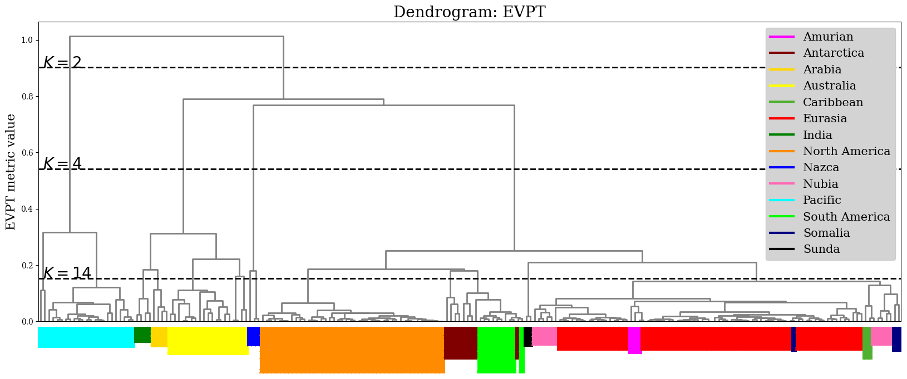
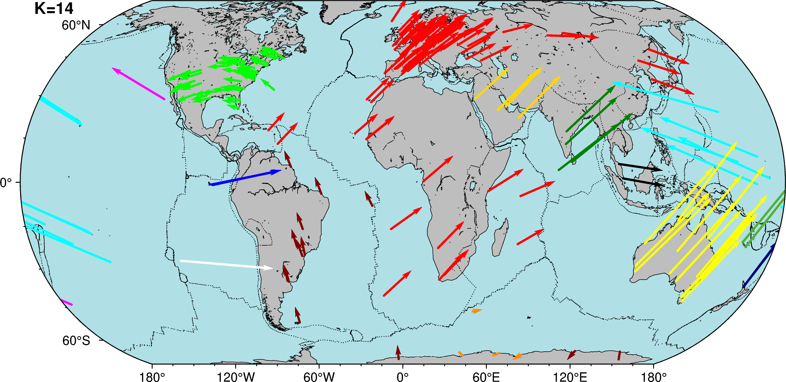
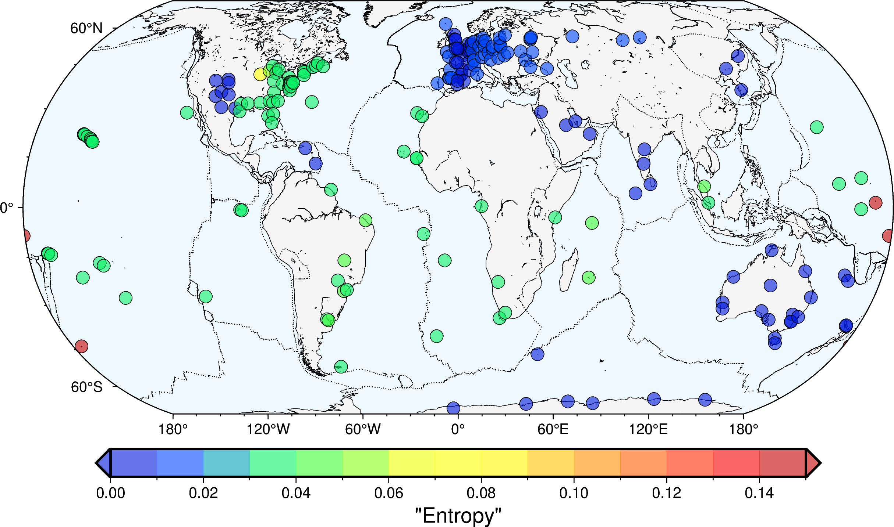
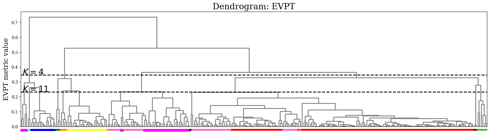
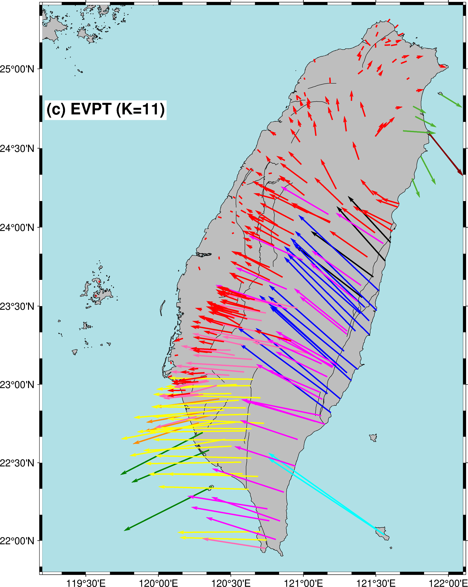
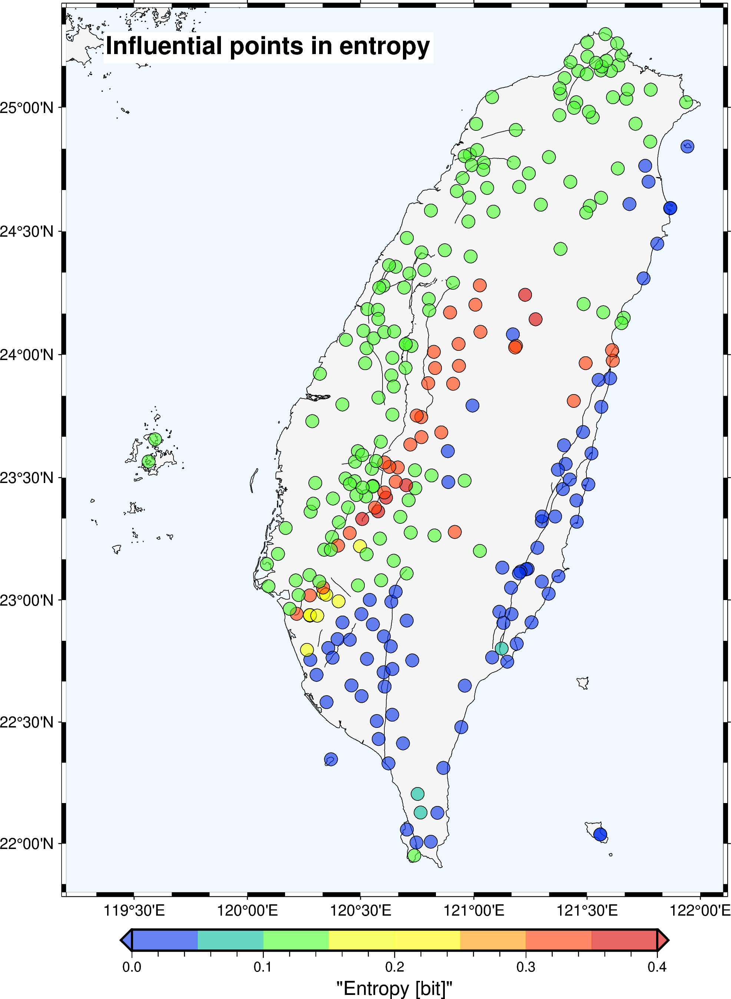

# TerraVector-Clust

## Table of Contents
- [About](#about)
- [Paper](#paper)
- [Demo](#demo)
- [Dependency](#dependency) 
- [Usage](#usage)

## About
TerraVector-Clust is a hierarchical clustering methodology for clustering data from a global navigation satellite system (GNSS) that is applicable at local to global scales. 
TerraVector-Clust first adapted the conventional 2D velocity clustering metric for global-scale applications by implementing parallel translation in differential geometry.
TerraVector-Clust then combined it with a Euler-vector-based metric to incorporate the kinematic constraint associated with the rigid motion of plates,
achieving advantages in identifying tectonic structures. 
This hybrid metric approach is assessed through two case studies at different spatial scales to determine whether it can accurately identify tectonic plate and crustal block boundaries: 
one study uses global-scale data from the ITRF2008 and ITRF2020 plate motion models, and the other focuses on a local-scale study in Taiwan. 
Results obtained using the hybrid metric consistently align better with geological data than those from either the 2D or Euler vector-based metrics alone. 
The proposed method is computationally efficient, enabling us to conduct two types of stability assessment: 
examination of the robustness of clusters with synthetic noise contamination and leave-one-out analysis. Both tests are demonstrated to be feasible within practical timeframes.

## Paper

- Title: A GNSS-velocity clustering method applicable at local to global scales
- Authors: Atsushi Takahashi (RIKEN, Center for Advanced Intelligence Project), Keisuke Yano (The Institute of Statistical Mathematics), and Masayuki Kano (Tohoku University)
- Journal: in revision

## Demo
TerraVector-Clust provides the dengrogram, the map view with given number of clusters, leave-one-out stability checks.

- Example: Application to the global-scale dataset (ITRF2008) provided by Altamimi et al. (2013)

- Example: Application to the local-scale dataset (Taiwan) provided by Tsai et al. (2015)

  
  

## Dependency
We provide the python implementation. 

The program requires the following packages:
- numpy　
- pandas 
- pygmt
- scipy
- scikit-learn
- umap (optional)

## Usage
The ipynb file demo_TerraVectorClust_v1.ipynb includes how to use our method.
The dataset folder include datasets used in our study. The following is a list of references:
- Altamimi, Z., Métivier, L., & Collilieux, X. (2012). ITRF2008 plate motion model. Journal of Geophysical Research: Solid Earth, 117 (B7).
- Altamimi, Z., Métivier, L., Rebischung, P., Collilieux, X., Chanard, K., & Barnéoud, J. (2023). Itrf2020 plate motion model. Geophysical Research Letters, 50 (24), e2023GL106373.
- Bird, P. (2003), An updated digital model of plate boundaries, Geochemistry Geophysics Geosystems, 4(3), 1027.
- https://github.com/fraxen/tectonicplates
- Takahashi, A., Hashimoto, M., Hu, J.-C., Takeuchi, K., Tsai, M.-C., & Fukahata, Y. (2019). Hierarchical cluster analysis of dense GPS data and examination of the nature of the clusters associated with regional tectonics in Taiwan. Journal of Geophysical Research: Solid Earth, 124 (5), 5174–5191.
- Tsai, M.-C., Yu, S.-B., Shin, T.-C., Kuo, K.-W., Leu, P.-L., Chang, C.-H., & Ho, M.-Y. (2015). Velocity field derived from Taiwan continuous GPS array (2007–2013). Terrestrial, Atmospheric & Oceanic Sciences, 26 (5).
- Lin,C.-W., Lu,S., & Chen,W.-S. (2012). Active fault map of Taiwan. Special publication of the Central Geological Survey.

## Responsibility
This paper is written by Keisuke Yano and checked by Astushi Takahashi and Masayuki Kano.
